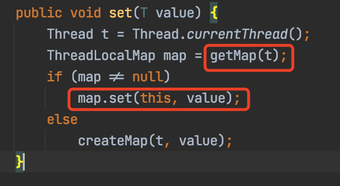
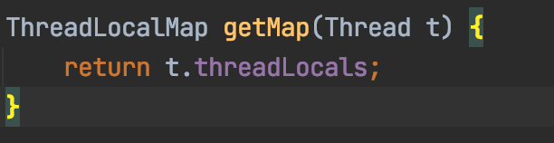
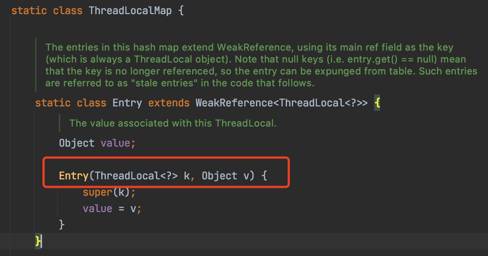
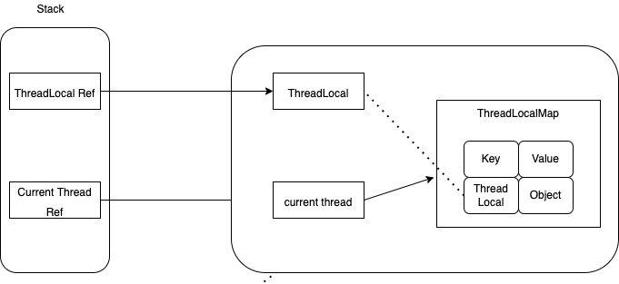
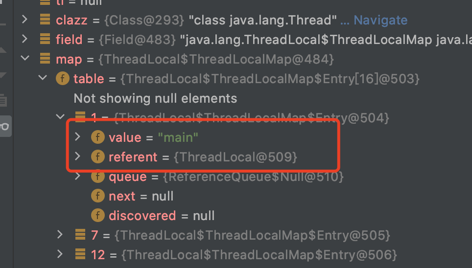
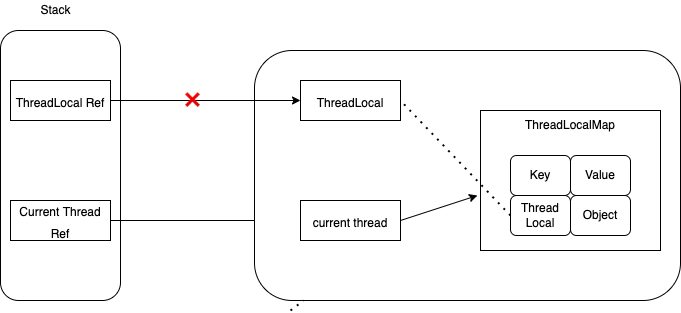
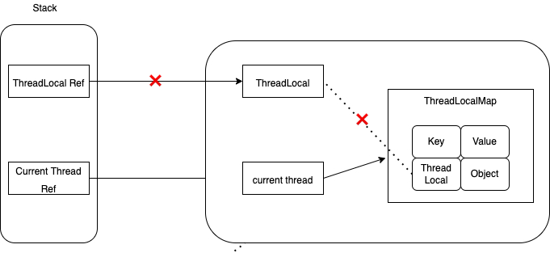
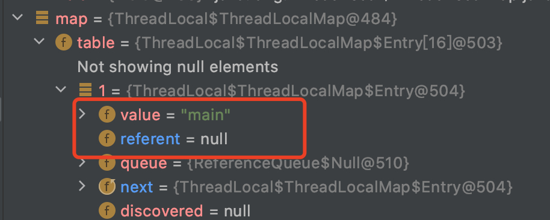
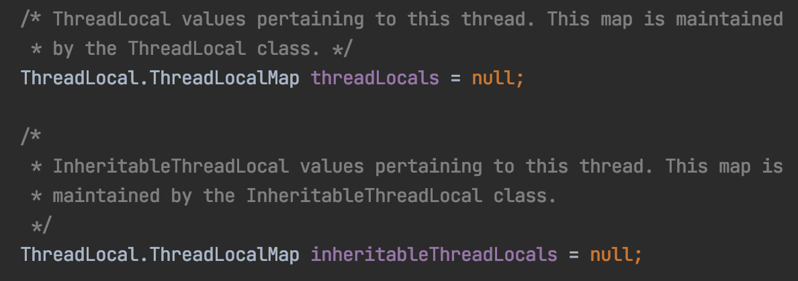
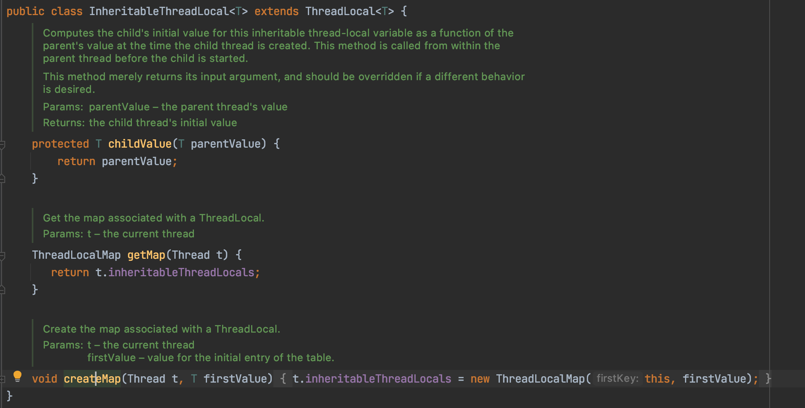

> 温馨提示: 本文需要垃圾回收、强弱引用、多线程等知识.

### ThreadLocal

#### 是什么

`ThreadLocal`, 从名字大概可以知道，它是个线程本地变量，意味着只有当前线程可以使用，线程之间相互隔离。

举个🌰：

```java
public class ThreadLocalApp {
    public static void main(String[] args) {
        ThreadLocal<String> tl = new ThreadLocal<>();

        tl.set("main");
        System.out.println("变更前, 主线程中的tl: "+tl.get());

        new Thread(new Runnable() {
            @Override
            public void run() {
                tl.set("sub thread");

                System.out.println("子线程中的tl: "+tl.get());
            }
        }).start();

        try {
            Thread.sleep(1000);
        } catch (InterruptedException ignore) {
        }

        System.out.println("变更后, 主线程中的tl: "+tl.get());
    }
}
```

输出:

```java
变更前, 主线程中的tl: main
子线程中的tl: sub thread
变更后, 主线程中的tl: main
```

上面的代码中，我们先主线中设置了`threadLocal`为`main`，然后在子线程中将tl设置为`sub thread`，这时候再去打印主线程的`tl`, 发现还是main. 可以看到，在当前线程设置`threadLocal`变量后，不会影响其他线程中该变量的值。


#### 有什么用

`ThreadLocal`很适合在单一线程中传递一些上下文信息。比如在`mvc`模型中，在`controller`中获取了用户信息，现在`service`层中要用到，一种方法就是把用户信息放到方法参数中，一层一层传递下去，但这样很繁琐，另一种方法就是利用`ThreadLocal`,在`controller`中设置好，在`service`中读取即可。


#### 实现原理

从`set`方法浅看下`threadLocal`的实现原理:



可以看到，所谓的`set`就是把`value`放到`ThreadLocalMap`里：



这个`map`是`Thread`的一个静态成员变量:

```java
    ThreadLocal.ThreadLocalMap threadLocals = null;
```

至此也就大概明了了：所谓`ThreadLocal`,也就是它维护了一个指向`Thread`对象的`ThreadLocalMap`类型的引用，其中`Map`的`key`为`ThreadLocal`类型，`set`和`get`的时候就是操作的都是`Thread`对象的`map`的`set`和`get`方法，说白了就是在操作线程的局部变量，自然不会受其他线程影响，也不会影响到其他线程。




### 在线程池中使用ThreadLocal

在线程池中使用`ThreadLocal`时要记得用完之后要及时使用`remove()`回收,原因如下:

#### 原因一: 线程池重复使用线程

  来看一个🌰:

```java
public class ThreadLocalInPoolApp {
    public static void main(String[] args) {
        ThreadLocal<String> tl = new ThreadLocal();
        ExecutorService executor = Executors.newFixedThreadPool(5);

        for (int i = 0; i < 5; i++) {
            int finalI = i;
            executor.submit(new Runnable() {
                @Override
                public void run() {
                    tl.set(String.valueOf(finalI));
                    System.out.println("set后,"+Thread.currentThread().getName()+" tl值:"+tl.get());
                }
            });
        }

        for (int i = 0; i < 5; i++) {
            int finalI = i;
            executor.submit(new Runnable() {
                @Override
                public void run() {
                    System.out.println("在新提交的任务里,"+Thread.currentThread().getName()+" tl值:"+tl.get());
                }
            });
        }
    }
}
```

输出:

```java
set后,pool-1-thread-2 tl值:1
set后,pool-1-thread-4 tl值:3
set后,pool-1-thread-1 tl值:0
set后,pool-1-thread-3 tl值:2
set后,pool-1-thread-5 tl值:4
在新提交的任务里,pool-1-thread-4 tl值:3
在新提交的任务里,pool-1-thread-5 tl值:4
在新提交的任务里,pool-1-thread-3 tl值:2
在新提交的任务里,pool-1-thread-1 tl值:0
在新提交的任务里,pool-1-thread-2 tl值:1
```


在上面的例子里，笔者创建了一个大小为5的的线程池，在第一个循环里给线程池里面的五个线程设置了tl的值，当后续又用这个线程池的时候，会发现之前设置的tl的值还在，这是因为线程池是复用核心线程的，如果用完`threadLocal`后不及时回收，就会出现上述现象。

下面为正确使用姿势:

```java
public class ThreadLocalInPoolApp {
    public static void main(String[] args) {
        ThreadLocal<String> tl = new ThreadLocal();
        ExecutorService executor = Executors.newFixedThreadPool(5);

        for (int i = 0; i < 5; i++) {
            executor.submit(new Runnable() {
                @Override
                public void run() {
                  try{
                    tl.set(String.valueOf(finalI));
                    System.out.println("set后,"+Thread.currentThread().getName()+" tl值:"+tl.get());
                  }finally{
                    tl.remove(); //要及时remove
                  }
                }
            });
        }

        for (int i = 0; i < 5; i++) {
            executor.submit(new Runnable() {
                @Override
                public void run() {
                    System.out.println("在新提交的任务里,"+Thread.currentThread().getName()+" tl值:"+tl.get());
                }
            });
        }
    }
}
```

输出:

```java
set后,pool-1-thread-1 tl值:0
set后,pool-1-thread-5 tl值:4
set后,pool-1-thread-4 tl值:3
set后,pool-1-thread-3 tl值:2
set后,pool-1-thread-2 tl值:1
在新提交的任务里,pool-1-thread-5 tl值:null
在新提交的任务里,pool-1-thread-2 tl值:null
在新提交的任务里,pool-1-thread-3 tl值:null
在新提交的任务里,pool-1-thread-4 tl值:null
在新提交的任务里,pool-1-thread-1 tl值:null
```


#### 原因二：降低内存泄露的可能

再来看下`ThreadLocal.ThreadLocalMap`里面的`entry`. 可以看到，`entry`的`key`是个`ThraedLocal`，并且是个弱引用。


对于如下代码:

```java
public class ThreadLocalApp {
    public static void main(String[] args) throws NoSuchFieldException, IllegalAccessException {
        //代码块①
        ThreadLocal<String> tl = new ThreadLocal<>();
        tl.set("main");
        
        //代码块②
        tl = null;

        //查看Map
        Class<?> clazz = Thread.currentThread().getClass();
        Field field = clazz.getDeclaredField("threadLocals");
        field.setAccessible(true);
        Object map = field.get(Thread.currentThread());

        //代码块③
        System.gc();

        //gc后再次查看map
         map = field.get(Thread.currentThread());
        System.out.println(map);
    }
}
```

执行完代码块①后，ThreadLocal对象的引用关系如下，其中实线为强引用, 虚线为弱引用。



这时候通过debug查看threadLocalMap,还是可以看到ThreadLocal以及指向它的弱引用的:



执行完代码块②后，ThreadLocal对象就只有一个弱引用指向它



在进行一次gc后，ThreadLocal就彻底沦为“孤儿”了：



这时候再去看ThreadLocalMap：



这时候唯一存在的一条指向`value`的引用链为：`Thread` -> `ThreadLocalMap` ->` Entry` -> `value`.  `value`虽然一直存在（只要当前线程在，`value就一直在`)，但是外界却无法获取它。这时候，就发生了内存泄露。要避免这个问题,也很简单，每次用完记得`remove`就行。


上面说了这么多，再来思考一个问题：内存泄露和弱引用有没有关系？

答案是没关系。即使不是弱引用，也会存在内存泄露，jdk使用弱引用只是为了让它能够被更好更快地回收，用文档原话说就是:

> ```
> To help deal with very large and long-lived usages, the hash table entries use WeakReferences for keys.
> ```


### 跨线程使用`ThreadLocal`

更真实的情况是，有时候代码中会有异步操作，但我们又希望在异步线程里也能拿到父线程的`ThreadLocal`变量，针对这种情况，JDK提供了`InheritableThreadLocal`.

#### `InheritableThreadLocal`

下述代码在主线程里设置了`InheritableThreadLocal`变量，在子线程中仍然可以获取

```java
public class InheritableThreadLocalApp {
    public static void main(String[] args) {
        //代码块①
        InheritableThreadLocal<String> tl = new InheritableThreadLocal<>();
        tl.set("main");

        new Thread(new Runnable() {
            @Override
            public void run() {
                System.out.println(tl.get());
            }
        }).start();
    }
}
```

输出:

```java
main
```


##### 实现原理

`Thread`类的成员变量共有两个`ThreadLocal.ThreadLocalMap`类型的变量，一个是`threadLocals`,另一个是`inheritableThreadLocals`.



而`InheriableThreadLocal`继承自`ThreadLocal`, 重写了`childValue`，`getMap`,`createMap`三个方法。




那父线程的`ThreadLocal`变量的值是什么时候悄咪咪的传递到子线程的呢？答案是创建线程的时候:

```java
public Thread(Runnable target) {
        init(null, target, "Thread-" + nextThreadNum(), 0);
    }
```


`init`方法里有这么一行关键代码:

```java
 if (inheritThreadLocals && parent.inheritableThreadLocals != null)
            this.inheritableThreadLocals =
                ThreadLocal.createInheritedMap(parent.inheritableThreadLocals);
```

相当于是把parent的`inheritableThreadLocal`给原样拷贝了一份。


##### 线程池与`InheritableThreadLocal`

从上面实现原理的分析可以知道，`InheritableThreadLocal`是在创建线程的时候传递`inheritableThreadLocal`的, 由于线程池是复用线程的，所以在线程池里使用`InheritableThreadLocal`同样是行不通的。


##### 如何破局

先来看症结在哪:
`InheritableThreadLocal`是通过`new Thread()`时进行的传递，考虑到线程池是通过`submit(Runnable)`的方式来提交任务，那是否意味着我们可以将线程池或者`Runnable`包装一下，在`submit`或者`run`方法执行前将`InheritableThreadLocal`进行传递呢？

阿里开源的`TransmittableThreadLocal`就基于上述的思想，分别通过

+ 增强`Runnable`或`Callable`

 使用`TtlRunnable.get()`或`TtlCallable.get()`, 提交线程池之后，在`run()`内取出变量

+ 增强线程池

使用`TtlExecutors.getTtlExecutor()`或`getTtlExecutorService()`、`getTtlScheduledExecutorService()`获取装饰后的线程池
使用线程池提交普通任务,在`run()`方法内取出变量（任务子线程）

两种方式解决了传统的`InheritableThreadLocal`的问题。

来看下效果:

```java
public class TransmittableThreadLocalApp {
    private static TransmittableThreadLocal<String> context = new TransmittableThreadLocal<>();

    public static void main(String[] args) {
        ExecutorService executor = Executors.newFixedThreadPool(5);

        context.set("value-set-in-parent");

        //空载，先将线程都创建起来
        for (int i = 0; i < 5; i++) {
            executor.submit(new Runnable() {
                @Override
                public void run() {
                }
            });
        }

        // 第一次提交
        Runnable task = new RunnableTask();
        executor.submit(TtlRunnable.get(task));

        context.set("value changed");
        executor.submit(TtlRunnable.get(task));
    }

    static class RunnableTask implements Runnable{
        @Override
        public void run() {
            System.out.println(context.get());
        }
    }
}

```

输出:

```java
value changed
value-set-in-parent
```

可以看到将值传到线程池的线程里。


### 总结

本文介绍了`ThreadLocal`和`InheritableThreadLocal`,以及它们在线程池中使用时需要注意的问题以及一些扩展。
