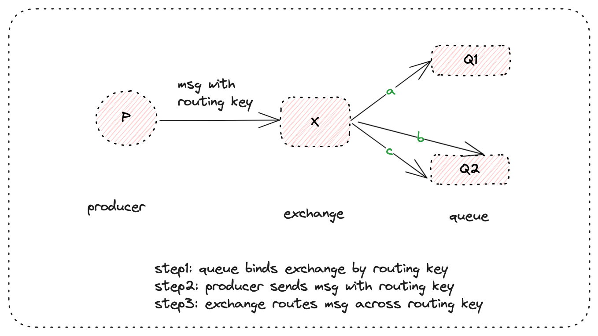
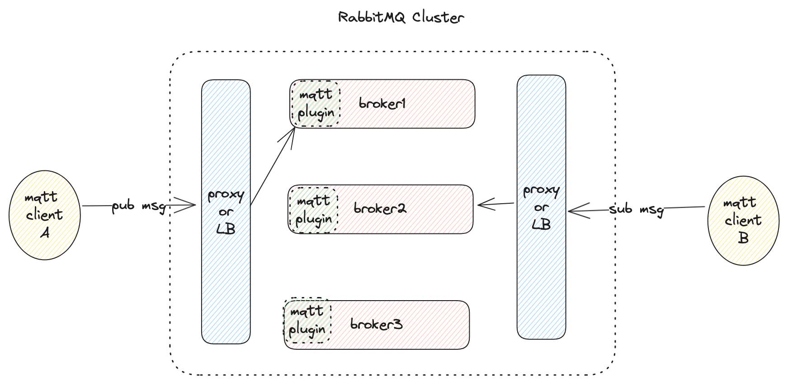
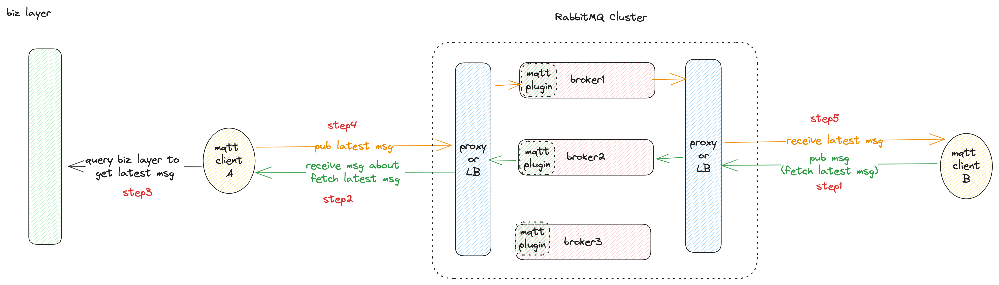

### 背景知识

#### RabbitMQ

RabbitMQ是一个基于高级消息队列协议 (Advanced Message Queue Protocal, AMQP) 的消息中间件，使用erlang开发，整体架构分为生产者(producer), 交换机(exchange), 队列(queue)和消费者(consumer)，整体结构如下：

和常见消息队列不同，RabbitMQ中没有topic的概念，而是使用一个相近的routing key的概念，这也是AMQP协议中的定义。当生产者发送消息时，消息会携带一个routing key, 这个routing key伴随着消息一起到达exchange, exchange主要起到路由的作用，根据不同的routing key将消息发送到不同的队列中去。那exchange怎么知道哪种routing key要发到哪个队列呢，这里就需要另一个概念: binding, binding描述了每个队列想要消费哪种类型的message, 换言之，binding通过routing key将exchange和queue关联起来，在上图中，Q1想要消费routing key为a的消息，Q2想要消费routing key为b和c的消息，而这种“想要”，就是通过binding实现的。

#### MQTT

MQTT（Message Queuing Telemetry Transport）是一种轻量级的发布/订阅消息协议，专为资源受限的设备和低带宽、不稳定的网络环境设计，因此常用于IOT领域，整体架构如下：

MQTT是全双工协议，双端的client可以既发布消息，由订阅消息。MQTT有些专为不稳定的网络环境而设计的特性：

1. QoS机制，提供三种消息传递质量（QoS）级别，确保消息的可靠传递：
   - **QoS 0**：最多一次传递（At most once）
   - **QoS 1**：至少一次传递（At least once）
   - **QoS 2**：只有一次传递（Exactly once）
2. Retain机制，即消息保留机制，broker会存储最新的保留消息，新的订阅者一旦订阅相关主题就会立即收到该消息。该机制常用于网络不稳定时出现断线重连的场景，以确保客户端总能收到最新消息。

#### RabbitMQ的MQTT插件

RabbitMQ有一套插件机制，可以使其支持其他协议，如MQTT. 因此RabbitMQ也可以用来作为MQTT的broker.

### 问题复现

组内同事使用RabbitMQ的mqtt插件进行通信时，发现客户端断线重连后再次订阅时，收到的消息不一定是最新的，从现象上看，似乎retain机制失灵了，最后查阅官方文档发现了这么一句话：

> An example that works is the following: An MQTT Client publishes a retained message to node A with topic `topic/1`. Thereafter another client subscribes with topic filter `topic/1` on node A. The new subscriber will receive the retained message.
>
> However, if a client publishes a retained message on node A and another client subsequently subscribes on node B, that subscribing client will not receive any retained message stored on node A.

这段话可以用下面的图描述：

MQTT插件是附着在RabbitMQ的broker上的，通常RabbitMQ集群都会有多个broker, 这也意味着会有多个MQTT插件，当mqtt clientA发布消息时，该消息会被集群的load balancer转发到broker1, 当mqtt client B订阅消息时，该请求同样会被load balancer转发，如果此时转发到了broker2, 那mqtt clientB就无法获取到最新的消息，**虽然client2获取了broker2上最新的消息，但不是全局最新的消息**。

### 解决方案

既然已经知道了问题所在，那要解决也是比较容易的，从上述分析可以看出，其实RabbitMQ的MQTT插件是不支持MQTT协议自身的retain机制的，因此，当客户端断线重连重新订阅时，**不要依赖retain机制去获取最新消息，而应该在业务层面去获取最新消息**，比如当客户端断线重连后重新订阅时，我们可以向broker发布一条特殊的消息，该消息的语义就是“我要获取最新的消息”，另一侧的客户端收到该消息后，通过业务层面的查询获取最新的消息，并发送给broker.

