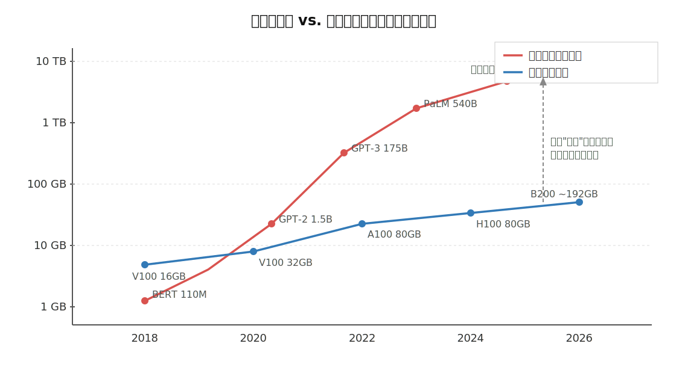
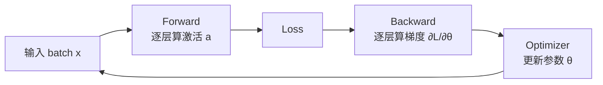
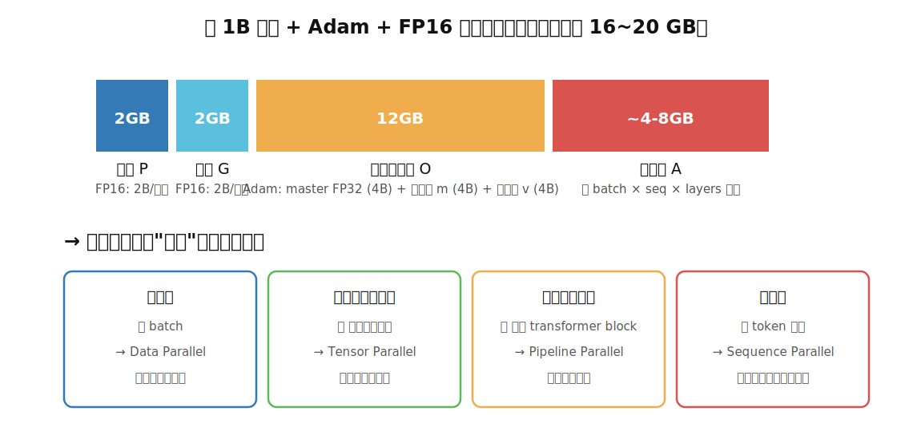
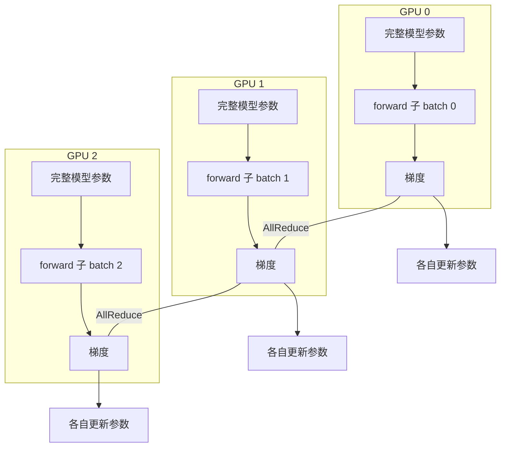
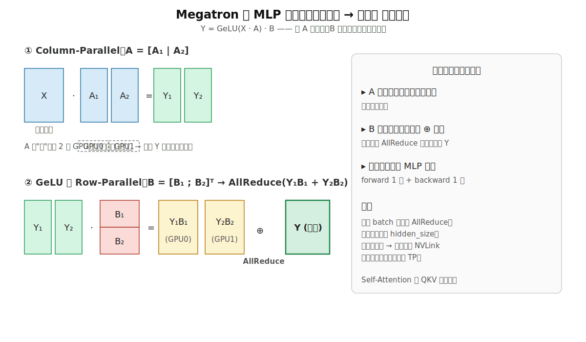
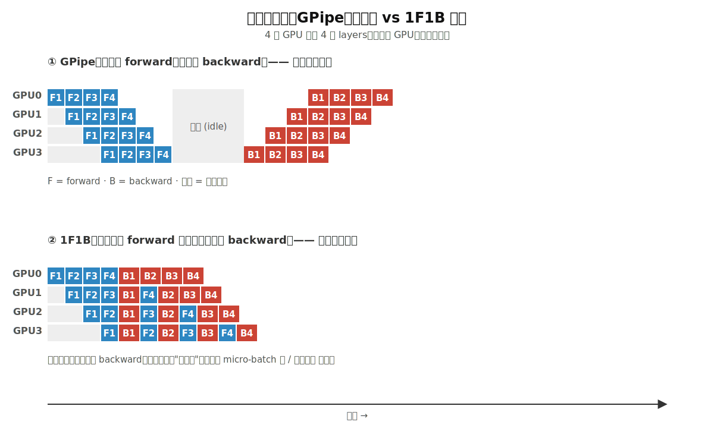
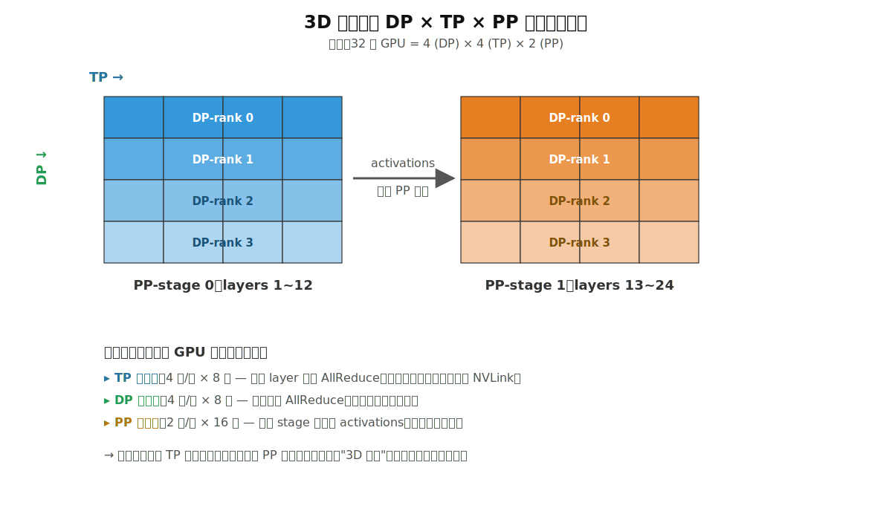
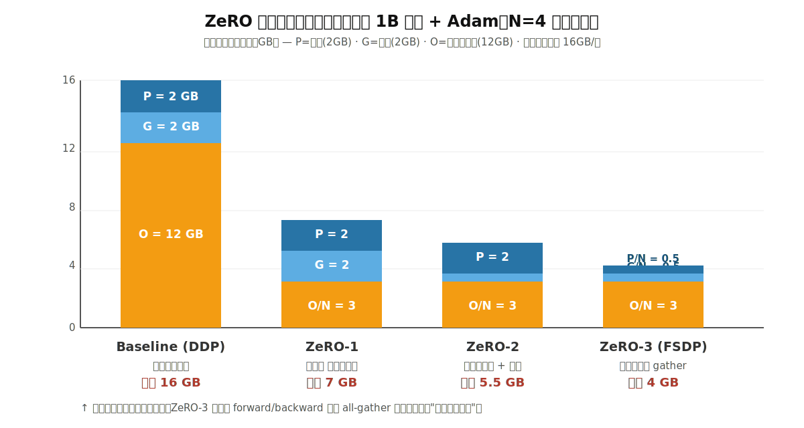
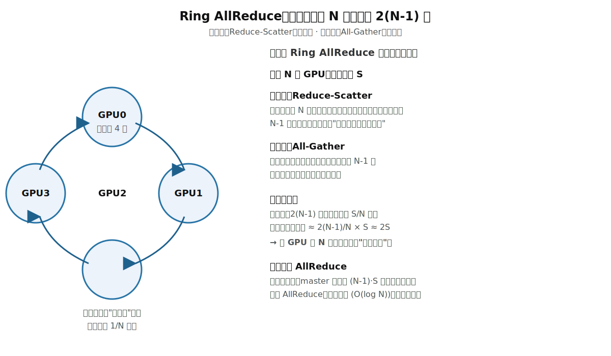
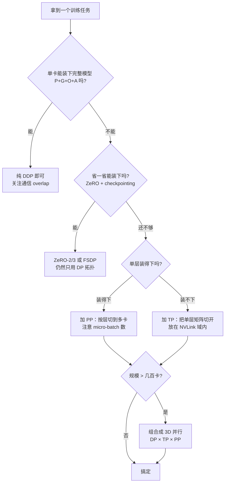

# 从第一性原理理解分布式训练

> 这篇文章不打算从"DP / TP / PP / ZeRO"这些名词出发，而是反过来：先回到训练这件事的物理与数学约束，再让每一种并行策略和优化技巧"自己长出来"。
> 读完之后，希望你看到任何一种新的并行方案，都能立刻问出一个对的问题——它在解决哪个约束？代价是什么？

---

## 一、引子：为什么单卡装不下了？

训练一个深度学习模型，本质是在解一个优化问题：

$$
\theta^{*}
=
\arg\min_{\theta}
\mathbb{E}_{(x,y)\sim\mathcal{D}}
\left[
\mathcal{L}(f_\theta(x), y)
\right]
$$

它需要三样东西不停喂进去：**算力**（算 forward / backward）、**显存**（放参数、激活、优化器状态）、**带宽**（如果有多张卡，要在它们之间搬数据）。

过去几年，模型规模呈指数级膨胀，而单卡显存只是缓慢线性增长——这中间撕开了一道**鸿沟**：

可以非常粗暴地概括为三堵墙：

- **算力墙**：单卡每秒能做的浮点运算有限。
- **显存墙**：单卡能装下的张量有限（H100 80GB，B200 ≈192GB）。
- **带宽墙**：跨卡、跨机数据搬运比片上访存慢几个数量级。

分布式训练的所有招数，本质上都是在**用其中一堵墙换另一堵墙**。理解了这一点，所有技术看起来就只是同一个公式的不同代入。

---

## 二、训练过程的本质拆解

### 2.1 一次迭代到底在干什么

forward 给出激活 $a_l$，backward 沿同样的路径反方向走一遍给出梯度 $g_l$。最后优化器（一般是 Adam）拿着 $g_l$ 把参数 $\theta$ 推一小步。

### 2.2 显存账本：1B 参数到底要多少

如果只看"参数本身有多大"，会严重低估真实显存需求。一次训练同时涉及四类张量：

以 1B（10 亿）参数 + Adam + FP16 混合精度为例：

| 类别          | 含义                                                | 大小     |
| ----------- | ------------------------------------------------- | ------ |
| **P** 参数    | FP16 权重，2 字节/参数                                   | 2 GB   |
| **G** 梯度    | FP16 梯度，2 字节/参数                                   | 2 GB   |
| **O** 优化器状态 | Adam 需要 master FP32 权重 + 一阶矩 m + 二阶矩 v，共 12 字节/参数 | 12 GB  |
| **A** 激活值   | forward 结果，必须保留以供 backward 使用，与 batch、序列长度、层数相关   | 4–8 GB |

合计 **16~20 GB / 卡**——而这才只是 1B 参数。GPT-3 是 175B，朴素估算就是 ~3 TB；显然单张 80GB 的卡装不下。

### 2.3 推论：四个可切分的维度

注意上面的四类张量，它们的"重复度"完全不同：

- 参数 P / 梯度 G / 优化器状态 O，在朴素 DDP 里，**每张卡都存一份完全一样的拷贝**，是冗余。
- 激活 A 是和当前 batch 强相关的，每张卡的内容是"自己 batch 的中间结果"。

由此推出，**理论上可切分的维度有 4 个**：

1. **数据维**——切 batch（DP）
2. **参数维**（层内）——切单层的权重矩阵（TP）
3. **层维**（层间）——切不同 transformer block（PP）
4. **序列维**——切 token 长度（SP）

后面三节就是把这四个方向逐一展开。

---

## 三、并行策略，从约束反推

### 3.1 数据并行 DP：参数装得下，但吞吐不够

**约束设定**：模型小到能塞进一张卡，但训练数据非常大，单卡跑不动。

**最自然的做法**：把 batch 切给 N 张卡，每张卡跑一遍 forward + backward，再把所有梯度加起来求平均，更新到自己那份完整参数上。

核心通信是一次 **AllReduce(梯度)**。

- **优点**：实现简单（PyTorch DDP 几行代码），可线性扩展吞吐。
- **代价**：参数 / 梯度 / 优化器状态在每张卡上都重复存了一份。
- **触发瓶颈**：当模型本身就装不下一张卡时，DP 立刻失效——这就把我们逼向下一种切法。

### 3.2 张量并行 TP：单层都装不下时，把矩阵切了

**约束设定**：模型的**单层**就已经超过单卡显存（比如 hidden size = 12288 的 GPT-3 一层 MLP 权重矩阵就是 12288 × 49152 × 2 字节 ≈ 1.2 GB，而权重本身只是冰山一角）。

**关键洞察**：matmul 天生可分块。如果

$$Y = X \cdot A$$

我们把 $A$ 按列切：$A = [A_1 \mid A_2]$，则

$$Y = X \cdot [A_1 \mid A_2] = [X A_1 \mid X A_2]$$

每张卡只算一半，得到 $Y$ 的一半列——**完全不需要中间通信**。

接下来如果再做一次 $Z = Y \cdot B$，把 $B$ 按行切（$B = [B_1; B_2]^\mathrm{T}$）：

$$Z = [X A_1 \mid X A_2]\;\begin{bmatrix} B_1 \\ B_2 \end{bmatrix} = X A_1 B_1 + X A_2 B_2$$

两张卡各算一项部分和，最后做一次 **AllReduce** 加起来即可。这就是 Megatron-LM 的核心 trick：

Self-Attention 的 QKV 投影是同一个套路：把"多头"按头切到不同卡上是天然合理的。

- **优点**：直接突破单层显存上限。
- **代价**：每个 layer 都要做一次 AllReduce，**通信量正比于 hidden size**，对带宽极敏感。
- **工程定律**：TP 通常只在**机内**（NVLink 域，~900 GB/s）使用，跨机做 TP 几乎一定会被网络拖垮。

### 3.3 流水线并行 PP：层数太多时，按层切

**约束设定**：模型有几百层，单卡放不下"那么多 layer"，但单层完全 OK。

**做法**：把 layer 1~12 放 GPU0，layer 13~24 放 GPU1，依此类推。一个 batch 像产品一样在流水线上走。

朴素实现的问题是**气泡（bubble）**：GPU 1 必须等 GPU 0 forward 完成才能开始，反向也一样。如果 batch 一次喂完，每张卡大部分时间都在"等隔壁"。

解决办法是把 batch 切成 **micro-batch**，再用 1F1B 这类调度，让 forward 和 backward 在时间轴上紧密交错：

气泡占比的经典估算是 $(p-1)/m$，其中 $p$ 是流水段数，$m$ 是 micro-batch 数——所以工程上经验是 **micro-batch 数尽量 ≥ 4 倍流水段数**。

- **优点**：通信只发生在 stage 边界，传的是 activations，**通信量很小**，可以跨机跨节点。
- **代价**：bubble + 实现复杂度（要做 schedule、要管参数版本）。
- **典型用法**：跨节点切层，机内再叠 TP，跨机再叠 DP——这就是下面要讲的 3D 并行。

### 3.4 序列并行 SP：长上下文下激活值爆炸

**约束设定**：参数装得下、层放得下，但**序列长度**太长（比如 1M tokens）让激活值（O(seq²) 的 attention map）爆掉。

**思路**：既然 batch 维可以切，序列维当然也可以切。Ring Attention、Megatron-SP、Context Parallel 都属于这一类。

最有趣的是 Ring Attention：把 K、V 在多张卡之间像传接力棒一样绕环传一圈，每张卡只处理一段 query 与流过来的 K、V 计算注意力，最终拼成完整结果。本质上是把"长上下文"在空间上摊开。

### 3.5 专家并行 EP（MoE）：参数越大越好，但每个 token 不需要全部参数

**约束设定**：想要更多参数（更强表达能力），但不想线性增加每个 token 的算力。

**做法**：MoE 把一个大 FFN 拆成 N 个 expert，每个 token 只路由到 top-k 个 expert。expert 们分散到不同 GPU 上，**这就是专家并行**。新的通信原语是 All-to-All（把每个 token 送到正确的 expert 卡上，再把结果拿回来）。

### 3.6 把它们叠起来：3D 并行

真实场景里，没有任何一种切法独立够用。一个典型的千卡训练通常是 **DP × TP × PP** 三个维度同时切：

每张 GPU 同时是三个通信群的成员：

- **TP 群**：高频、带宽密集 → 放最快互联（机内 NVLink）。
- **DP 群**：中频、可与计算 overlap → 放节点间 InfiniBand。
- **PP 群**：低频、点对点小消息 → 对带宽要求最低，可放最慢链路。

**这条"按通信频率匹配互联速度"的拓扑映射原则**，才是 3D 并行真正的工程精髓——所有的 mesh 配置最终都是为这件事服务的。

---

## 四、显存的极限优化：ZeRO 与重计算

3D 并行解决了"装不下"的问题，但 DP 维上每张卡仍然完整复制一份 P / G / O——非常浪费。**ZeRO 系列做的事情，就是逐步消除这份冗余**。

### 4.1 ZeRO 的三阶段

- **ZeRO-1**：把**优化器状态 O** 切到 N 张卡上，每张卡只存自己负责那一份。更新参数前先 ReduceScatter 梯度，更新后 AllGather 参数。
- **ZeRO-2**：在 ZeRO-1 基础上，**梯度 G** 也分片存。
- **ZeRO-3**（≈ PyTorch FSDP）：连**参数 P** 也分片存。每个 forward / backward 用到某层时，临时 AllGather 一下，用完立刻丢掉。

**省显存几乎是线性的**：N 越大，单卡需要存的越少。但对应代价是每个 forward / backward 都要多一次通信。这又是一个清晰的"用带宽换显存"的交易。

### 4.2 Activation Checkpointing：用计算换显存

forward 时不保存所有中间激活，backward 用到时再重新算一遍。

- 节省：激活显存 ≈ √L 量级（按段切的话）。
- 代价：forward 计算量 +33% 左右。

### 4.3 Offload：用 PCIe 带宽换显存

把暂时用不到的参数 / 优化器状态搬到 CPU 内存（甚至 NVMe），需要时再搬回来。代价是 PCIe 带宽（~64 GB/s）远低于显存带宽（~3 TB/s），所以只在显存极度紧张时使用。

可以把 ZeRO + Checkpointing + Offload 看成一条"显存 ↔ 带宽 ↔ 算力"的三向汇率，根据自己集群实际的瓶颈去调。

---

## 五、通信原语：分布式训练的"血管"

上面所有方案都在不停说"AllReduce、AllGather、ReduceScatter"——这些是底层的集合通信原语。

| 原语 | 干什么 | 典型用途 |
|---|---|---|
| **Broadcast** | 一对多 | 初始化广播参数 |
| **Reduce** | 多对一求和 | 梯度汇总到 master |
| **AllReduce** | 多对多求和 | DP 梯度同步 |
| **AllGather** | 各持一段 → 各拿全部 | ZeRO-3 取参数 |
| **ReduceScatter** | 全量 → 各拿一段（聚合后） | ZeRO 切分梯度 |
| **All-to-All** | 每对节点都交换不同数据 | MoE expert 路由 |

恒等关系：**AllReduce = ReduceScatter + AllGather**。这个等式很重要，它解释了为什么 ZeRO 在通信总量上常常和 DDP 一致——只是切开了，分两步做。

### Ring AllReduce：为什么是带宽最优的

朴素 AllReduce 的实现是"每张卡把自己的梯度发给一个 master，master 求和再发回去"——master 的带宽是 $(N-1)\cdot S$，立刻成为瓶颈。

Ring AllReduce 的做法天才得多：

- 把梯度切成 N 段，每张卡只和"右邻居"通信。
- 阶段一 **Reduce-Scatter**：N-1 步后，每张卡握有"全网累加好的某一段"。
- 阶段二 **All-Gather**：再 N-1 步把每段广播回来。
- 总通信量：每张卡发出 ≈ $2S$，**与 N 无关**——这就是"带宽最优"。

代价是延迟变高（$2(N-1)$ 步），所以在小消息或机器数极多时，会用 tree、双二叉树等延迟更优的拓扑替代。NCCL 在背后会自动选。

---

## 六、一张图收束：分布式训练的决策路径

把前面的逻辑全压缩成一张决策树：

回头看，每一步的选择都不是因为"DeepSpeed 文档这么说"，而是被某一堵墙逼出来的：

- 装不下 → 切（ZeRO / TP / PP）。
- 算不快 → 复制再并行算（DP）。
- 通信太重 → 重叠、压缩、换拓扑（Ring AllReduce）。
- 显存还不够 → 拿计算 / 带宽换（Checkpointing / Offload）。

---

## 七、写在最后

分布式训练给人的第一印象常常是"名词太多、堆栈太厚"。但只要你抓住三件事——

1. **训练消耗的是算力、显存、带宽**这三种资源。
2. 资源之间可以**互换**：用计算换显存，用带宽换显存，用更多机器换时间。
3. 任何一种并行策略，都是**在某个约束下做的最优交易**。

—— 你就拥有了一把万能的尺子，可以衡量每一个新出来的技巧（FlashAttention、Sequence Parallel 的各种变体、新的 Mixture-of-Experts 路由方案……）落在哪个交易上、代价又是什么。
