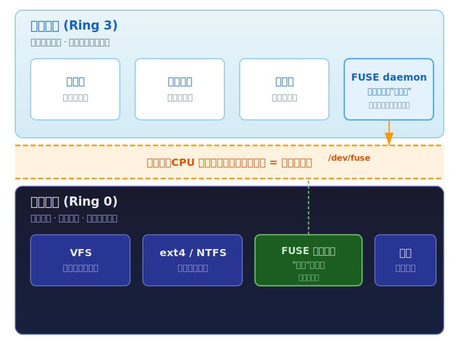
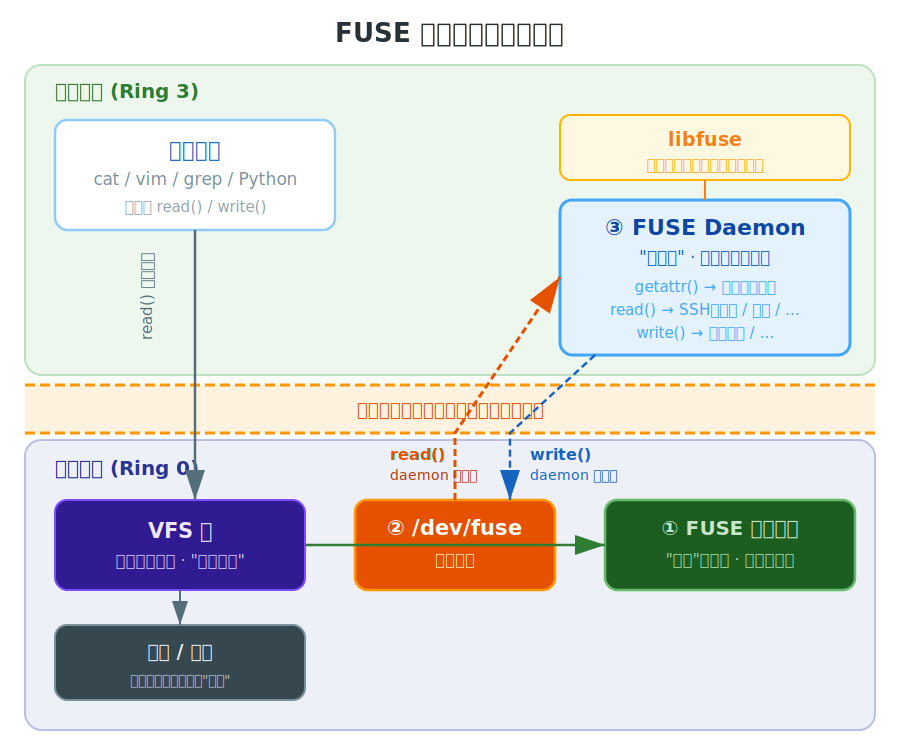
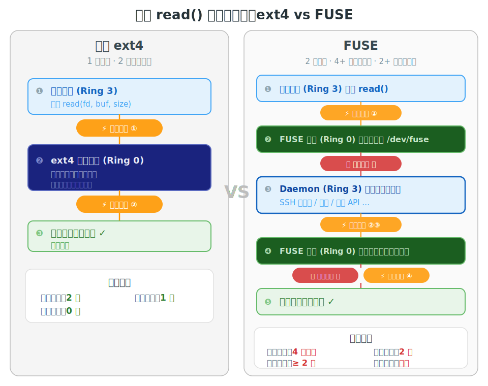

# FUSE: 让文件系统工作在用户空间

> 读完这篇文章，你会理解：为什么文件系统必须住在内核里；这件事给"自定义文件系统"制造了什么根本矛盾；FUSE 如何用"内核空壳 + 用户态灵魂"的解耦化解这个矛盾；以及这种解耦的性能代价和适用边界。

---

## 从一个具体需求说起

假设你接到一个需求：**把远程服务器的目录挂载成本地文件夹**，让同事直接用 `vim`、`grep`、文件管理器访问远程文件，就好像文件在本地一样。

需求很合理。怎么实现？

第一反应可能是"写个文件系统"。但你很快发现，传统文件系统跑在内核里——这意味着你得用受限的内核 C 开发，一个 bug 就能把整台机器搞宕机，还得为每个内核版本重新编译。你明明只是想做个 SSH 数据转发，却被迫先成为内核专家。

这引出一个更尖锐的问题：

> **写一个自定义文件系统，一定要懂内核吗？有没有办法用普通的编程语言、在普通的用户态进程里实现文件系统逻辑，同时让 `cat`、`ls`、`vim` 完全无感地使用它？**

这正是 FUSE 解决的问题。但要理解它的解法，得先理解它面对的约束。

---

## 一、Why：文件系统为什么*必须*在内核里，以及这件事为什么痛

### 内核空间与用户空间：那道不可逾越的墙

把电脑想象成一座城堡。最里层的**内堡**住着内核（kernel），它直接握着控制硬件的开关——硬盘、内存、网卡、CPU——在这一层，代码能对机器做任何事，也能让整台机器宕机。城堡外圈的民居住着普通应用程序：浏览器、你的脚本，这一层叫**用户空间（user space）**。

为什么要隔开？**因为任何代码都可能出 bug，而 bug 在内堡里的后果是致命的。** 浏览器崩了，如果它住在内堡、能直接碰硬件，一崩就拖垮整台机器；隔开之后，它崩了就崩了，操作系统负责回收清理，别的程序照跑。这道墙的全部意义就是**隔离故障域**：内堡里的代码权力无限但必须绝对可靠，外圈的代码随便折腾、崩了也不影响大局。



这道墙是 CPU 在硅片层面物理保证的。x86 用"特权级（Ring）"实现：Ring 0 是内核模式，能执行任何指令；Ring 3 是用户模式，一大堆危险指令被硬件禁止。用户程序**无法**自己把档位从 Ring 3 改到 Ring 0——否则墙就形同虚设。升权只能从几个固定的"正门"发生，最典型的是**系统调用（system call）**：你的程序执行一条 `syscall` 指令，CPU **一气呵成地**做两件不可分割的事——把权限档位升到 Ring 0，**并强制跳转到内核早就设定好的入口地址**。换句话说，**升权的同一瞬间，执行权就已经交到了内核手里**，你没机会以 Ring 0 的身份跑自己的代码。

这也就导致了：**每一次系统调用，控制权都要"穿过护城河"一来一回。这种穿越是有成本的**——后面 FUSE 的性能损耗，原因就在这里。

### 文件系统为什么必须住在内核

存储设备（硬盘、SSD）本身根本不懂"文件"。它只是一长条编了号的块（逻辑块地址，LBA），只会听"把第 N 号块的内容给我"。"文件""文件夹""文件名""权限"这些概念，全都是**文件系统**这层软件编造出来的幻觉。文件系统干的事是：把文件名映射到散落在设备各处的块、维护目录树、记录元数据、在你 `read` 时翻译成一堆对块设备的指令。ext4、NTFS、APFS 都是这层逻辑的不同实现。

关键点在于，**这层逻辑跑在内核里（Ring 0）。** 因为它要直接操作块设备硬件，而碰硬件是特权操作，只有 Ring 0 能干；而且文件系统是所有程序共享的关键基础设施，必须由内核统一看管。

### 当你想做一个"古怪文件系统"时，痛点来了

回到开篇的需求。类似的合理需求还有很多：把本地文件夹做成"往里拖文件就自动加密上传到云"；把一个 .zip 当成可浏览的目录。要实现它们，按传统做法，你得**把这套逻辑写成内核代码、塞进 Ring 0**。而这件事的痛点是：

1. **开发地狱。** 内核里基本只能用受限的 C，没有你熟悉的网络库、加密库、高级语言。普通程序崩了重跑就行，内核代码崩了**整台机器直接宕机**，改一行验证一次的成本极高。
2. **爆炸半径无限大。** 同样一个空指针 bug，发生在用户态只是"这个程序崩了，重开"；发生在 Ring 0 就是**全机宕机**，甚至默默写坏别人的内存。更糟的是它是个安全漏洞放大器：你的业务代码被攻破，因为它在 Ring 0，攻击者直接拿到整台机器的最高权限。
3. **分发门槛高。** 装内核模块要 root，还要为用户的内核版本重新编译，内核接口跨版本还会变。

### 根本矛盾

把三条痛点压缩，会得到一个根本矛盾：

> **文件系统逻辑*必须*活在内核里（才能碰硬件、才能被所有程序当作文件用），但内核又是*最不适合*写普通业务逻辑的地方（语言受限、一错全崩、门槛高）。**

一边拽着"必须在内核"，一边拽着"实在不该在内核"。这就是 FUSE 要化解的矛盾。

---

## 二、What：FUSE 是什么

FUSE（Filesystem in Userspace）的核心用四个字总结：**劈成两半。** 内核里只留一个不含任何业务逻辑的"转发员"，真正的繁重工作全部交给一个普通的用户态进程去做。



### 三个角色

1. **FUSE 内核模块（住 Ring 0 的"空壳"）。** 它不含任何业务逻辑，唯一的工作是当二传手：把"有人要读这个文件"的请求从内核 VFS 转发到用户态，再把用户态算好的结果转发回来。因为它逻辑极简、永不改动，所以它**不会爆炸**。
2. **`/dev/fuse`（信使通道）。** 内核空壳和用户态进程之间的通信，被包装成一个"设备文件"。daemon 用最普通的 `read()`/`write()` 操作它：`read` 表示"给我下一个待办请求"，`write` 表示"这是我对该请求的答复"。
3. **用户态守护进程 daemon（住 Ring 3 的"真逻辑"）。** 这才是真正的大脑，而且它是个**彻头彻尾的普通用户态程序**——想用 Python 就 Python，网络库、加密库随便用。它崩了？只是这一个进程崩了，全机安然无恙。

此外还有 **libfuse**：一个用户态库，把"循环读 `/dev/fuse`、解析内核发来的二进制协议、根据请求类型调用你对应的回调"这些样板代码封装好。有了它，你写文件系统时**只需填几个回调函数**——`getattr`（返回文件大小/权限/类型）、`readdir`（实现 `ls`）、`read`（实现 `cat`）、`write` 等等。

### 矛盾是怎么被化解的

- **"必须在内核"** → 满足：内核里确实有一个 FUSE 模块，VFS 照常把它当文件系统对待，`cat`、`vim`、任何程序完全无感，它们就是在读一个普通文件。
- **"不该在内核写业务逻辑"** → 也满足：真正的业务逻辑根本不在内核，而在那个可以随便崩、随便用高级语言、不需要 root 编译内核的用户态 daemon 里。

一句话：**FUSE 改变的不是"能否自定义文件系统"，而是"自定义这件事发生在哪"——它把爆炸半径从全机缩小到了一个进程。**

### 三个设计决策的"不可省略性"

- **为什么内核里还非得留个空壳？** 因为 `cat`/`ls` 这类程序的文件请求只会送进内核 VFS。必须有个内核侧的模块在 VFS 那层注册、声明"这个挂载点归我管"，才能把请求转给 daemon。没有它，daemon 就是个孤岛，谁都找不到它。这也正是 FUSE 强大的根源：它复用了 VFS 这个"万能插座"，于是你的古怪文件系统**自动兼容了世界上所有会读文件的软件**。
- **为什么用 `/dev/fuse` 这个设备文件？** 因为"一切皆文件"。把通道做成文件样的东西，daemon 就不需要任何新奇的特殊 API，用最熟悉的 `read`/`write` 即可。注意：选它不是因为"快"——它甚至增加了开销——而是因为接口统一、零学习成本。
- **为什么要有 libfuse？** 因为裸手操作 `/dev/fuse`、自己解析二进制协议的样板代码冗长繁琐，且对每个 FUSE 程序都一样。libfuse 把这些全部封装好，你只写业务回调。

---

## 三、How：一次 read 是怎么走的

理解了架构，我们把同一次文件读取在两种文件系统里走一遍，体会 FUSE "劈分"的代价。



**普通 ext4：**

```
[1] 你的程序(Ring3)  read() 喊话
        │  ── 模式切换① 进 Ring0
[2] 内核 ext4(Ring0) 碰硬盘拿数据
        │  ── 模式切换② 回 Ring3
[3] 程序拿到数据
```

总共：1 个进程，2 次模式切换。干净利落。

**FUSE：**

```
[1] 你的程序(Ring3)   read() 喊话
        │  ── 模式切换① 进 Ring0
[2] FUSE空壳(Ring0)   把请求挂到 /dev/fuse，阻塞你的程序
        │  ── 进程切换Ⓐ 唤醒 daemon 这个"另一个进程"
[3] daemon            之前阻塞在 read(/dev/fuse) 的内核里，
        │              请求到达，read() 返回 ── 模式切换② 回 Ring3
[4] daemon(Ring3)     在用户态跑真逻辑（SSH 拉数据/解密…）
        │              算完把结果 write 回 /dev/fuse
        │  ── 模式切换③ 进 Ring0 ── 模式切换④ 回 Ring3（write 返回）
[5] FUSE空壳(Ring0)   收到结果，唤醒最初被阻塞的程序
        │  ── 进程切换Ⓑ 切回原程序  ── 模式切换⑤ 回 Ring3
[6] 你的程序拿到数据
```

| | 普通 ext4 | FUSE |
|---|---|---|
| 涉及进程 | 1 个 | **2 个** |
| 进程切换 | 0 次 | **≥2 次**（Ⓐ Ⓑ） |
| 模式切换 | 2 次 | **≥5 次**（①②③④⑤） |
| 数据拷贝 | 少 | 更多 |

这就是 FUSE 性能开销的来源：**为了把活儿外包给安全的用户态 daemon，每次操作凭空多出了进程切换和数倍的模式切换。** 

### 这个开销什么时候有影响，什么时候可以忽略

判断依据只有一个：**瓶颈在哪。**

- **无感**：sshfs 的瓶颈是网络延迟（几十毫秒），FUSE 那点切换开销（几微秒）淹没在里面根本看不见。
- **明显感知**：对一个有成千上万文件的大目录执行 `ls -l`，每个文件都触发一次 `getattr`，每次都得绕一圈到 daemon。**这就是 FUSE 文件系统 `ls -l` 常常很慢的原因。**

缓解手段：内核**页缓存**能把读过的数据缓存起来，第二次读同一段可能直接命中、根本不惊动 daemon；一次读一大块而非逐字节，把固定切换成本摊薄。但元数据操作的开销基本省不掉。

---

## 四、边界：真用起来会撞到的墙

- **daemon 崩了 / 被 kill：** 正在读这个文件系统的程序会收到错误（典型是 `ENOTCONN`，"传输端点未连接"）或卡住，可能留下需要 `fusermount -u` 强制卸载的"僵尸挂载点"。但**全机存活，重启 daemon 即可恢复**。这正是"爆炸半径从全城缩到一间民房"的具体兑现。
- **权限默认值：** 一个 FUSE 挂载默认**只有挂载它的那个用户能访问**，连 root 默认都看不到——这是防止恶意 FUSE 骗别人的安全默认值。要让别人也能访问，得显式开 `allow_other`，通常需要管理员放行。
- **不可信来源要警惕：** daemon 是普通用户态进程，能看到所有经它的文件内容，还能对不同读取返回不同内容（制造 TOCTOU 竞态）。别随便去读不可信者挂载的 FUSE。
- **语义打折：** `mmap`、某些 `ioctl`、文件锁的精确语义，因为多绕了一层用户态，支持有限或行为微妙。

---

## 五、意义：它改变了"谁有资格写文件系统"

FUSE 在真实世界养活了一大批东西，它们有一个共同点——**都不是"在硬盘上存字节"，而是"把某种古怪的数据源伪装成文件"**：

- **sshfs**：数据源是网络，把远程目录挂成本地文件夹。
- **s3fs / rclone mount**：数据源是云存储，把 S3、Google Drive 挂成本地盘。
- **gocryptfs / EncFS**：你看到的是明文，落盘的是密文，加解密全在 daemon 里。
- **AppImage**：运行时用 FUSE 把自己临时挂载解压出来跑——你可能用过却不知道。

为什么这件事重要？可以从三个层面来理解：

**第一，门槛的本质是技能错配。** FUSE 之前，"做个古怪文件系统"被锁死在一小撮内核专家手里。不是因为想法稀缺，而是因为它要求的技能（内核 C、Ring 0 调试、root 编译）和这件事真正需要的技能（懂 SSH、懂加密、懂云 API）严重错配——你明明想写业务逻辑，却被迫先成为内核专家。

**第二，FUSE 让"写文件系统"民主化了。** 它把所需技能从"内核开发"换成了"会写普通程序"。于是一大批有想法但不是内核专家的人，第一次有资格做文件系统。能力本身没变强，但**能行使这个能力的人数暴增了几个数量级**。世界因此多出了 sshfs、s3fs、gocryptfs——不是因为技术突破，而是因为门槛塌了，被压抑的需求一下子涌了出来。

**第三，也是影响最深远的一层：伪装成文件，就等于免费接入了整个生态。** "文件"是操作系统生态里最通用的接口。你把数据源伪装成文件，`vim`、`grep`、Photoshop、`python open()`、文件管理器……**所有会读文件的软件都自动会用它，你一行适配都不用写**。把云存储伪装成文件夹的价值，不在"伪装"本身，而在伪装之后，你瞬间拥有了几十年来所有为"文件"而写的现成工具。

---

## 六、什么时候*不该*用 FUSE

理解了代价，何时回避就很清楚：

- **追求极致性能的主力盘**（ext4/NTFS 那种高频本地读写）：FUSE 每次操作的切换开销在高频场景下会非常明显。
- **元数据极密集的负载**（海量小文件的频繁 `stat`/`ls`）：`getattr` 的开销躲不掉。
- **强依赖精确底层语义**（`mmap`、文件锁原子性）的场景。

FUSE 最适合的场景始终是：**逻辑古怪、依赖外部库（网络/加密/云）、不追求极致性能、希望普通人也能写能装**的文件系统。

---

## 收束

> **FUSE 用"内核空壳 + 用户态灵魂"的劈分，把"写文件系统"从内核专家的高危特权，降格成普通开发者的日常；代价是每次操作多绕一圈的切换开销；而它真正的价值，是让任意数据源借"文件"这个万能接口，瞬间接入整个软件生态。**
